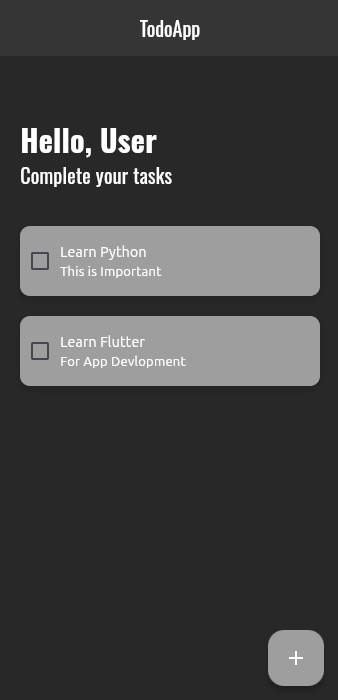
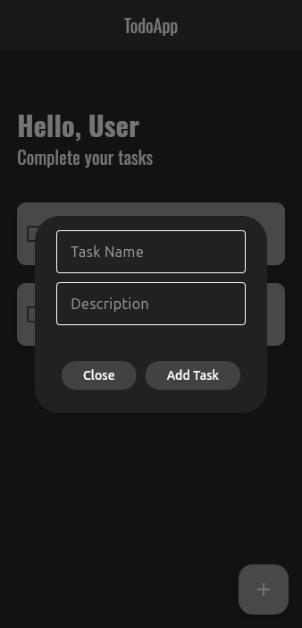

# 📝 Flutter Todo App


### ⚠️ Archived Learning Project

This repository is an early learning project.
Check out my improved version here:

👉 https://github.com/Theprogrammizz/ticktask-flutter

A clean and minimal Todo application built using Flutter and Hive for local storage.

---

## 📸 Screenshots




---

## 🚀 Features

- ✅ Add new tasks
- ✏ Edit tasks
- 🗑 Delete tasks
- 🔁 Toggle task completion
- 💾 Persistent storage using Hive

---

## 🛠 Tech Stack

- Flutter
- Dart
- Hive (Local Database)
- Provider (State Management)

---

## 📦 Installation

1. Clone the repository

```bash
git clone https://github.com/yourusername/flutter-todo-app.git
```

2. Navigate into the project

```bash
cd flutter-todo-app
```

3. Get dependencies

```bash
flutter pub get
```

4. Run the app

```bash
flutter run
```

---

## 📂 Folder Structure

```
lib/
 ├── models/
 ├── providers/
 ├── screens/
 ├── widgets/
 └── main.dart
```


---

## 👨‍💻 Author

Deva  
GitHub: https://github.com/theprogrammizz
